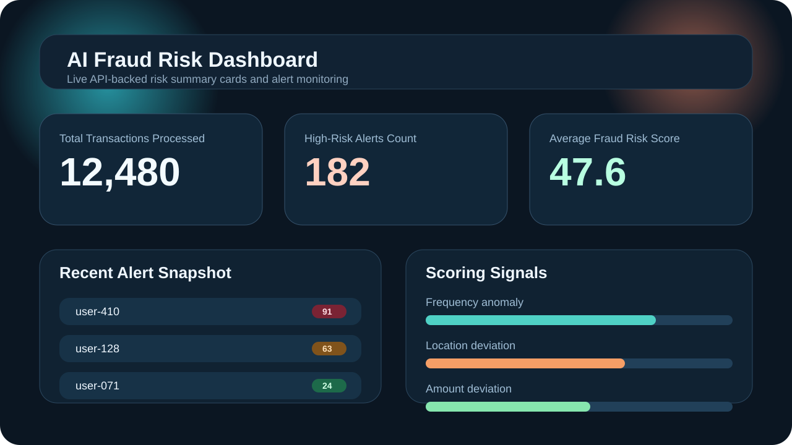

# Chhavi-AI-Fraud-Risk-Platform

Scores transactions based on fraud likelihood using behavioral and transactional patterns.

## AI Fraud Risk Scoring Setup

The backend now uses an injected AI/ML scoring engine (`IFraudRiskModelEngine`) and exposes a dedicated prediction endpoint at `POST /api/ai/predict`. The implementation preserves the `Controller -> Service -> Repository` flow:

- `AiController` handles the HTTP API contract.
- `AiPredictionService` validates requests, gathers historical transaction signals, and runs model inference.
- `PredictiveFraudModelEngine` loads the ML.NET model artifact from `Models/ML/fraud-risk-model.zip`.
- `ITransactionRepository` supplies recent activity, average amount, and location history features.

Backend requirements:

- .NET SDK 10
- SQL Server Express or another SQL Server instance reachable from the configured connection string

Frontend requirements:

- Node.js 22+
- Angular CLI 21

Backend setup:

```powershell
cd api\src\FraudRiskApi
dotnet restore
dotnet run
```

Update `api/src/FraudRiskApi/appsettings.json` if your SQL Server instance is different from `.\\SQLEXPRESS`.

Run the AI prediction API:

```powershell
curl -Method POST http://localhost:5257/api/ai/predict `
  -ContentType "application/json" `
  -Body '{
    "userId": "user-100",
    "amount": 12500.00,
    "location": "Bengaluru",
    "timestamp": "2026-04-30T12:00:00Z"
  }'
```

Sample response:

```json
{
  "userId": "user-100",
  "riskScore": 76,
  "riskLevel": "High",
  "confidenceScore": 0.76,
  "modelVersion": "fraud-risk-ml-v1",
  "predictedAtUtc": "2026-05-01T05:30:00Z"
}
```

Frontend setup:

```powershell
cd ui
npm install
npm start
```

The Angular app expects the API at `http://localhost:5257/api/v1`.

## Dashboard Preview

The dashboard now exposes API-backed summary cards for:

- Total Transactions Processed
- High-Risk Alerts Count
- Average Fraud Risk Score

Screenshot:



## Flow Documentation

- Sequence diagram: [docs/ai-risk-scoring-sequence.md](docs/ai-risk-scoring-sequence.md)
- AI model integration: [docs/ai-model-integration.md](docs/ai-model-integration.md)
- UI verification checklist: [ui/tests/risk-summary-cards-checklist.md](ui/tests/risk-summary-cards-checklist.md)
