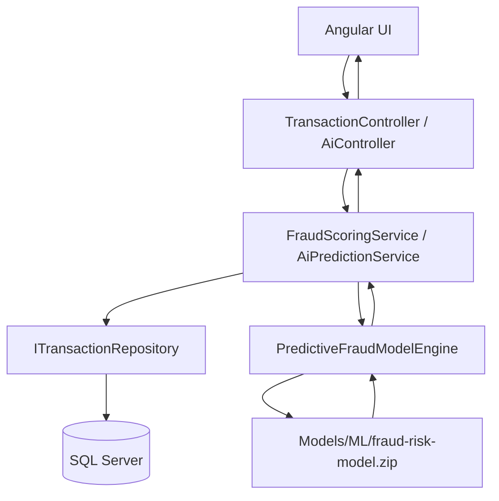

# System Design Document - AI Fraud Risk Scoring Platform

## 1. Overview

The AI Fraud Risk Scoring Platform is a full-stack analytical system for transaction intake, behavior analysis, and real-time fraud risk prediction.  
The platform has evolved from a rule-based prototype into a live ML.NET-powered predictive system that returns model-driven risk signals to the UI and API consumers.

Primary goals:
- Ingest transaction events reliably.
- Build behavioral context from user history.
- Run low-latency predictive inference for fraud risk.
- Provide actionable risk outputs for dashboarding and alerting.

## 2. Technology Stack

### Frontend
- Angular 21
- TypeScript
- RxJS
- Angular HTTP client + dashboard services

### Backend
- ASP.NET Core (`net10.0`)
- Entity Framework Core + SQL Server
- Layered architecture (`Controller -> Service -> Repository`)
- ML.NET (`Microsoft.ML`)
- FastTree training/inference support (`Microsoft.ML.FastTree`)

### Platform Transition
- Previous scoring mode: deterministic rule-weight aggregation.
- Current scoring mode: predictive inference using a trained binary classification model artifact.

## 3. Core Features

- Transaction logging with validation and persistence.
- Behavior-aware context enrichment from historical transactions.
- Machine learning-based fraud scoring (core implementation).
- Risk classification (`Low`, `Medium`, `High`, plus `Unavailable` on model failures).
- Alert and summary APIs consumed by the dashboard.
- Operational logging for model load, inference, and fallback/error conditions.

## 4. System Architecture

The backend uses strict layering and keeps frontend and backend responsibilities separated.



Runtime inference path:
1. Controllers accept request payloads.
2. Services construct `FraudRiskContext` using repository-backed historical metrics.
3. `PredictiveFraudModelEngine` loads the serialized `.zip` model artifact and executes prediction.
4. Probability output is transformed to an application risk score and risk level.
5. Response is returned to API consumers and UI.

## 5. Fraud Scoring Logic (Implemented)

### Model Type
- Binary classification using FastTree (gradient-boosted decision trees).
- Output signal is fraud likelihood probability in range `0.0` to `1.0`.

### Score Conversion
- Raw model probability is mapped to user-facing risk score:
  - `riskScore = probability * 100`
  - 1-decimal precision is preserved in scaling logic prior to final score handling.

### Risk Bands
- `High`: score >= 70
- `Medium`: score >= 40 and < 70
- `Low`: score < 40
- `Unavailable`: model not loaded or inference cannot run (error score path)

### Error Visibility
- Flat fallback integers are removed as normal behavior.
- Model-unavailable path is explicit and observable (`-1` sentinel in backend response flow).

## 6. Detailed Design

### 6.1 Feature Engineering Layer

The predictive engine transforms domain context into model-ready features:
- `NormalizedAmount`
- `AmountToAverageRatio`
- `RecentTransactionCount`
- `DistinctLocationCount`
- `IsLocationChanged`

These are derived from current request data plus historical transaction state retrieved from repository queries.

### 6.2 Model Engine Responsibilities

`PredictiveFraudModelEngine`:
- Resolves model path using `AppContext.BaseDirectory` (runtime-first lookup).
- Validates artifact availability (`File.Exists`) before loading.
- Loads trained model through `MLContext.Model.Load(...)`.
- Runs thread-safe inference via `PredictionEngine`.
- Logs raw inference probability before scaling.
- Returns explicit unavailable/error response when model loading/inference fails.

### 6.3 Output Mapping

`FraudModelOutput` supports model artifact column mapping for:
- `Probability`
- `Score`

The engine validates output ranges and uses robust probability resolution to avoid silent mis-mapping.

## 7. ML Lifecycle

### 7.1 Training Utility

A trainer utility is included at:
- `scripts/TrainModel.cs`
- `scripts/TrainModel.csproj`

Behavior:
- Creates a small fraud/non-fraud dataset (dummy seed data for bootstrap).
- Trains FastTree binary classifier using ML.NET.
- Saves artifact to:
  - `api/src/FraudRiskApi/Models/ML/fraud-risk-model.zip`

Example command:

```bash
dotnet run --project scripts/TrainModel.csproj
```

### 7.2 Build and Deployment Availability

`api/src/FraudRiskApi/FraudRiskApi.csproj` includes:

```xml
<ItemGroup>
  <None Include="Models\ML\fraud-risk-model.zip" CopyToOutputDirectory="PreserveNewest" />
</ItemGroup>
```

This ensures the model artifact is copied to the runtime output directory (`bin/...`) so the engine can load it during application startup.

### 7.3 Runtime Activation

At startup:
- If model load succeeds, logs `"ML Model Successfully Loaded ..."`.
- If model is missing or load fails, logs explicit errors and inference returns unavailable status.
- Once artifact is present and copied, unavailable state transitions to live predictive scoring automatically.

## 8. API and Data Flow

### Primary APIs
- `POST /api/v1/transaction`
- `GET /api/v1/transaction/summary`
- `GET /api/v1/transaction/alerts`
- `POST /api/ai/predict`

### End-to-End Flow
1. Client submits transaction or AI prediction request.
2. Service layer gathers historical signals via repository.
3. Predictive engine computes probability and score.
4. Service persists/returns scored output.
5. Dashboard APIs provide summaries and alerts for visualization.

## 9. Observability and Operations

- Startup logging confirms model load success/failure.
- Inference logging captures raw probability values for diagnostics.
- Error logging distinguishes:
  - Missing model artifact.
  - Model load exception.
  - Inference unavailable path.
- Build-time artifact copy reduces environment drift between source and runtime paths.

## 10. Assumptions and Limitations

### Assumptions
- SQL Server is reachable for repository-backed context computation.
- Model artifact is generated and copied as part of build/release workflow.
- Feature schema in trainer and inference engine remains synchronized.

### Current Limitations
- Trainer currently uses bootstrap/dummy data and should be replaced by curated production datasets for best accuracy.
- Model governance (version registry, drift monitoring, retraining scheduler) is not yet fully automated.

### Success Note
- System now provides high-precision predictive scoring using Gradient Boosted Trees (FastTree via ML.NET), replacing rule-only scoring behavior.
