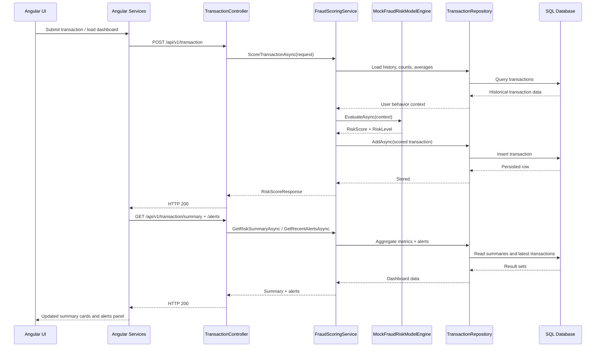

# AI Risk Scoring Data Flow

```mermaid
sequenceDiagram
    participant Analyst as Angular UI
    participant DashboardSvc as Angular Services
    participant Api as TransactionController
    participant Service as FraudScoringService
    participant Model as MockFraudRiskModelEngine
    participant Repo as TransactionRepository
    participant Db as SQL Database

    Analyst->>DashboardSvc: Submit transaction / load dashboard
    DashboardSvc->>Api: POST /api/v1/transaction
    Api->>Service: ScoreTransactionAsync(request)
    Service->>Repo: Load history, counts, averages
    Repo->>Db: Query transactions
    Db-->>Repo: Historical transaction data
    Repo-->>Service: User behavior context
    Service->>Model: EvaluateAsync(context)
    Model-->>Service: RiskScore + RiskLevel
    Service->>Repo: AddAsync(scored transaction)
    Repo->>Db: Insert transaction
    Db-->>Repo: Persisted row
    Repo-->>Service: Stored
    Service-->>Api: RiskScoreResponse
    Api-->>DashboardSvc: HTTP 200
    DashboardSvc->>Api: GET /api/v1/transaction/summary + /alerts
    Api->>Service: GetRiskSummaryAsync / GetRecentAlertsAsync
    Service->>Repo: Aggregate metrics + alerts
    Repo->>Db: Read summaries and latest transactions
    Db-->>Repo: Result sets
    Repo-->>Service: Dashboard data
    Service-->>Api: Summary + alerts
    Api-->>DashboardSvc: HTTP 200
    DashboardSvc-->>Analyst: Updated summary cards and alerts panel
```
